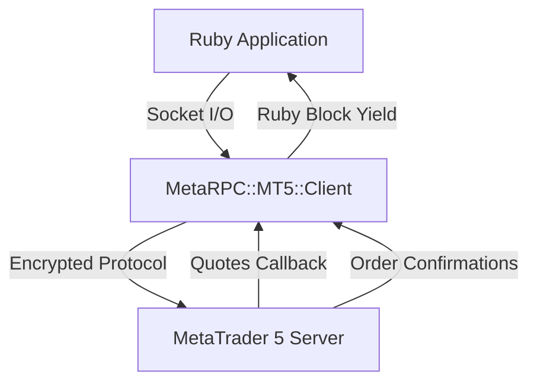

# RubyMT5 SDK

Welcome to the **RubyMT5 SDK** documentation. This gem provides an idiomatic Ruby interface connecting directly to MetaTrader 5 servers without requiring a local MT5 desktop terminal or Wine.

## Key Features

- **Pure Ruby Implementation**: Zero native extensions or Wine overhead.
- **Block-Based Quote Streaming**: Stream real-time ticks using standard Ruby blocks.
- **Full Trade Execution**: Market orders, limit, stop, and stop-limit orders, SL/TP trailing, and closing.
- **Account Monitoring**: Live equity, margin, margin level, leverage, and trade history.

## Architecture



## Quick Installation

Add to your Gemfile:

```ruby
gem 'metarpc_mt5', git: 'https://github.com/MetaRPC/RubyMT5.git'
```

And run:

```bash
bundle install
```

See [Getting Started](getting-started.md) to start trading.
